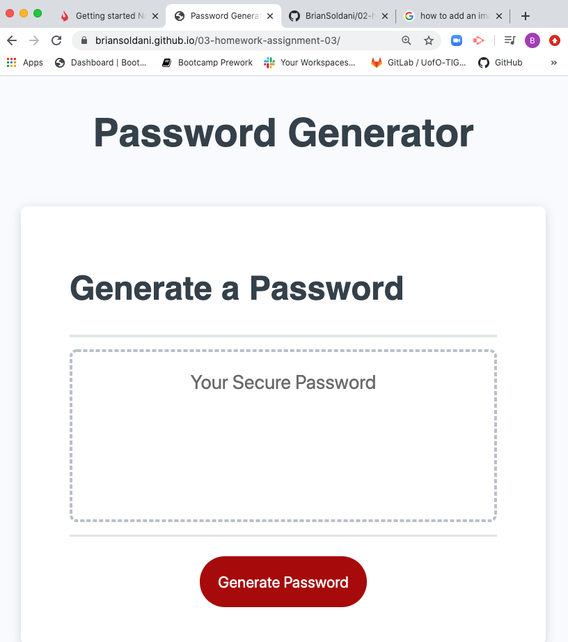

# Unit 03 Javascript: Password Generator

## Description
This assignment was to use the given HTML, CSS, and JavaScript files, with some starter code, to make a functioning random password generator. The final product needed to prompt users for input such as desired password length, whether to use numbers or symbols, and whether to use lowercase or uppercase letters. The password could be anywhere from 8 to 128 characters in length and only consist of the items chosen by the user through conifrming and prompts. HTML5, CSS3 and JavaScript were used and implemented for this project.

### Project Details
Using the above mentioned technologies and code sources, the deployed application was created. The application consists of the following:

- A JavaScript function that generates a password.
- Confirmation messages to the user for inclusion of types of letters, numbers, or symbols.
- An alert if the user chooses none of these options.
- A prompt asking the user for the desired password length.
- An alert if the user chooses more or less than the given range of 8-128 characters.
- There are four seperate functions that each contain references to sets of characters in an external chart, ubiquitous to coding. 
- Based on the user selections and input, the password is generated for the desired length and contains the selected items.
- Once the password displays on the page, the user is free to start the process over again.
 
 #### Results
 The final application performs as expected and meets the requirements given above. If the user selects the desired password elements to use, they are given a randomly generated password that meets their desired criteria. If they happen to not like the password given to them on the first attempt, they are able to run the process over and over again until a more desired password is achieved.

#### URL of Deployed Application + Image 
 https://briansoldani.github.io/03-homework-assignment-03/

